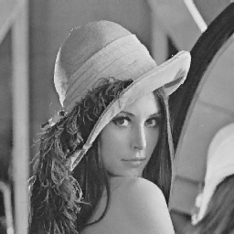

# Fractal compression task
## Creating environment
```sh
python3 -m venv debayering_env
source debayering_env/bin/activate
pip3 install -r requirements.txt 
```
## Usage
```
usage: main.py [-h] --img_path IMG_PATH --save_dir SAVE_DIR [--block_size {4,8}] [--n_iterations N_ITERATIONS] [--debug_scale DEBUG_SCALE]
optional arguments:
  -h, --help            show this help message and exit
  --img_path IMG_PATH   input image path
  --save_dir SAVE_DIR   save dir path
  --block_size {4,8}    Block size for patterns.
  --n_iterations N_ITERATIONS
                        Restoring iterations.
  --debug_scale DEBUG_SCALE
                        scale for debugging resize of original image
```

# Results
## Block size 4
### Lena
decoded image



Maximum psnr value: 32.08


### Boat
decoded image


Maximum psnr value:  29.72


### Goldhill
decoded image


Maximum psnr value: 30.91


## Block size 8
### Lena
decoded image


Maximum psnr value: 26.26


### Boat
decoded image


Maximum psnr value: 24.12


### Goldhill
decoded image


Maximum psnr value: 25.41


